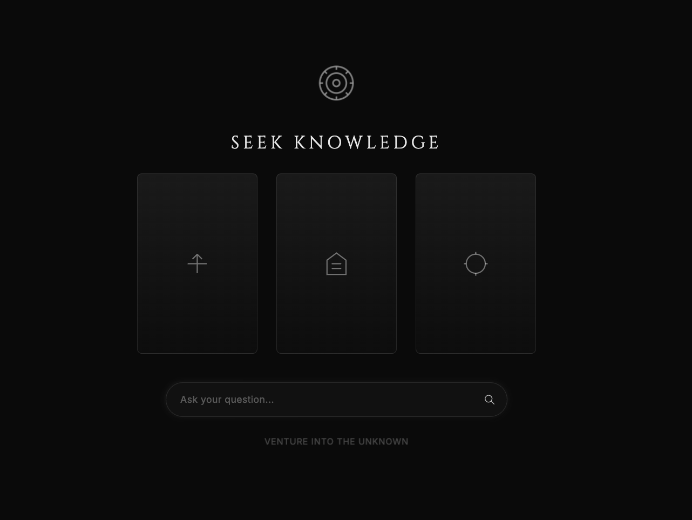
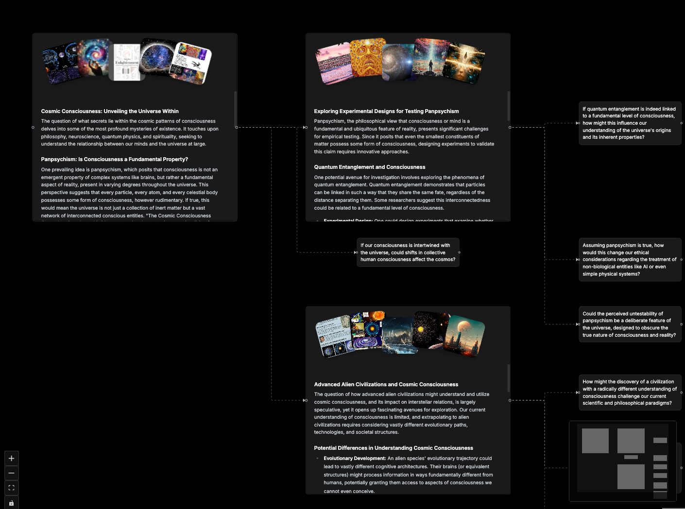
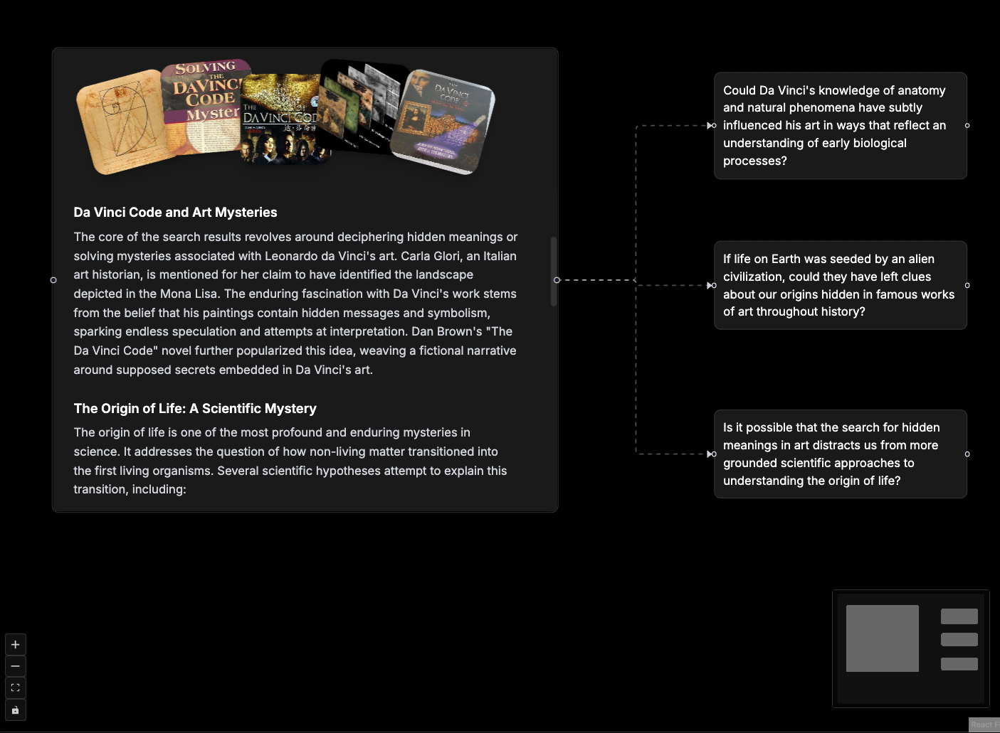
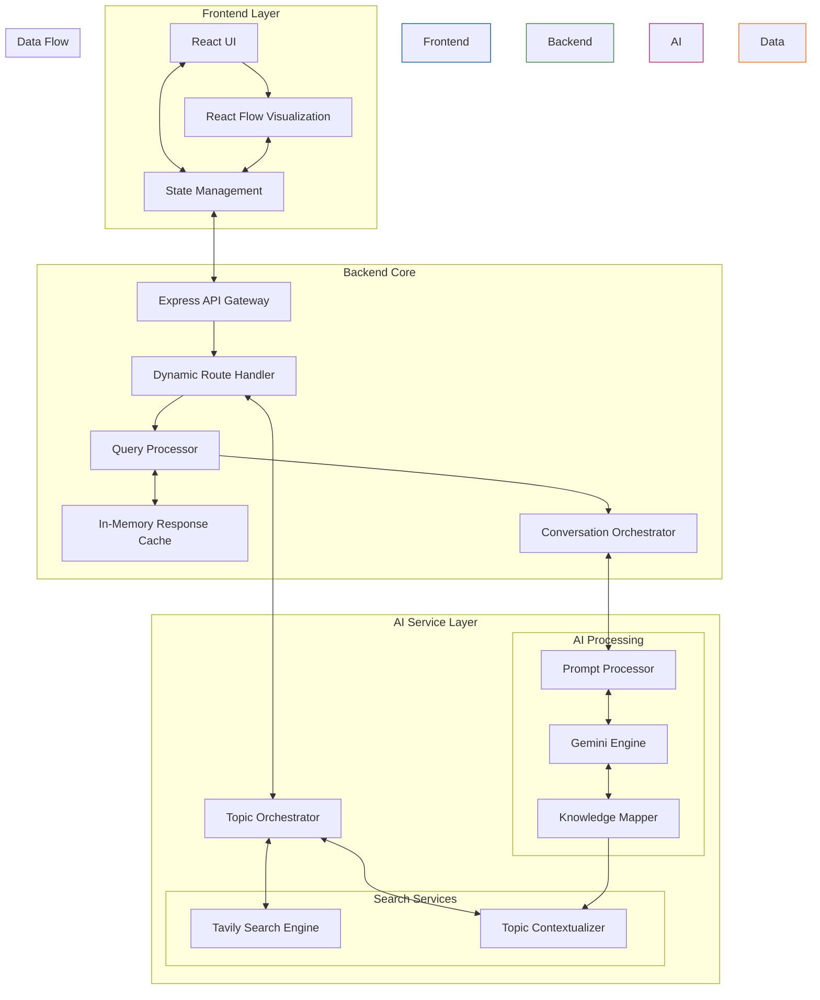

# 🐰 RabbitHole - Knowledge Explorer

[](https://railway.app/)

## 🚀 Quick Deploy

### Railway Deployment

1. Click the "Deploy on Railway" button above
2. Set up your environment variables in Railway:
   ```
   TAVILY_API_KEY=your_tavily_api_key
   GOOGLE_AI_API_KEY=your_google_ai_api_key
   ```
3. Railway will automatically detect the Dockerfile and deploy your application

## 🛠️ Local Development

### Prerequisites
- Node.js 18 or higher
- npm or yarn
- Docker (optional)

### Setup

1. Clone the repository:
```bash
git clone https://github.com/yourusername/rabbitholes.git
cd rabbitholes
```

2. Install dependencies:
```bash
npm install
```

3. Create environment files:

For backend (backend/.env):
```env
PORT=3000
TAVILY_API_KEY=your_tavily_api_key
GOOGLE_AI_API_KEY=your_google_ai_api_key
```

For frontend (frontend/.env.development):
```env
REACT_APP_API_URL=http://localhost:3000/api
```

4. Start development servers:
```bash
# Start both frontend and backend in development mode
npm run dev

# Or start them separately
npm run frontend:dev
npm run backend:dev
```

## 🐳 Docker Development

1. Build the Docker image:
```bash
docker build -t rabbitholes .
```

2. Run the container:
```bash
docker run -p 3000:3000 \
  -e TAVILY_API_KEY=your_tavily_api_key \
  -e GOOGLE_AI_API_KEY=your_google_ai_api_key \
  rabbitholes
```

Or using docker-compose:

```bash
docker-compose up
```

## 📦 Project Structure

```
rabbitholes/
├── frontend/              # React frontend
│   ├── src/
│   ├── public/
│   └── package.json
├── backend/              # Express backend
│   ├── src/
│   └── package.json
├── Dockerfile           # Production Dockerfile
├── docker-compose.yml   # Docker compose configuration
└── package.json        # Root package.json for workspace
```

## 🔑 Environment Variables

### Backend Variables
- `PORT` - Server port (default: 3000)
- `TAVILY_API_KEY` - Your Tavily API key
- `GOOGLE_AI_API_KEY` - Your Google AI API key

### Frontend Variables
- `REACT_APP_API_URL` - Backend API URL
  - Development: http://localhost:3000/api
  - Production: /api

## 📝 License

MIT

# Open RabbitHoles 🐰

[](https://buymeacoffee.com/sheing)

Introducing Open RabbitHoles - an open source implementation inspired by the original RabbitHoles app, but with our own twist. Dive deep into the rabbit holes without the premium price tag. This tool helps you dive deep into any topics, discover unexpected connections, and visualize your research journey in an interactive mind map.

Built with React, Node.js, and powered by a combination of Tavily and Google AI, this implementation offers a unique approach to mind map style exploration and knowledge mapping.

## Screenshots 📸


*The main interface showing the "SEEK KNOWLEDGE" header and search functionality*


*An example exploration map showing topics around cosmic consciousness, panpsychism, and quantum entanglement*


*Exploring connections between Da Vinci's work and scientific mysteries*

## Why Open RabbitHoles? 🤔

- 🆓 Free and open source alternative to premium research tools
- 🔄 Unique implementation combining multiple AI providers for better results
- 🎯 Custom-built visualization algorithms for knowledge mapping
- 🚀 Enhanced with Tavily's search capabilities
- 💡 Powered by Google Gemini for deeper insights

## Features 🚀

- Interactive mind-map style exploration
- AI-powered content generation and connections
- Beautiful, fluid UI with React Flow
- Real-time topic exploration and visualization
- Seamless backend integration with OpenAI

## Tech Stack 💻

### Frontend
- React
- TypeScript
- React Flow
- Tailwind CSS
- Dagre (for graph layouts)

### Backend
- Node.js
- Express
- TypeScript
- OpenAI API integration

## Architecture 🏗️
Potential production architecture for the project.



## Getting Started 🌟

### Prerequisites
- Node.js (v14 or higher)
- npm or yarn
- OpenAI API key

### Installation

1. Clone the repository
```bash
git clone https://github.com/AsyncFuncAI/rabbitholes.git
cd rabbitholes
```

2. Install dependencies
```bash
# Install root dependencies
npm install

# Install frontend dependencies
cd frontend
npm install

# Install backend dependencies
cd ../backend
npm install
```

3. Set up environment variables
```bash
# In backend/.env
PORT=3000
TAVILY_API_KEY= your_tavily_api_key
GOOGLE_AI_API_KEY= your_google_api_key
```

4. Start the development servers
```bash
# Start backend (from backend directory)
npm run dev

# Start frontend (from frontend directory)
npm start
```

## Usage 🎯
1. Open your browser and navigate to `http://localhost:3001`
2. Enter a topic you want to explore in the search bar
3. Watch as the AI generates connections and builds your exploration map
4. Click on nodes to dive deeper into subtopics
5. Save and share your exploration paths

## Contributing 🤝
Contributions are welcome! Please feel free to submit a Pull Request.

1. Fork the repository
2. Create your feature branch (`git checkout -b feature/AmazingFeature`)
3. Commit your changes (`git commit -m 'Add some AmazingFeature'`)
4. Push to the branch (`git push origin feature/AmazingFeature`)
5. Open a Pull Request

## License 📝
This project is licensed under the MIT License - see the [LICENSE](LICENSE) file for details.

## Credits 🙏

This project is powered by [Dojoma AI](https://dojoma.ai). Special thanks to team from Dojoma AI for contributing to this project.


---
Built with ❤️ 
